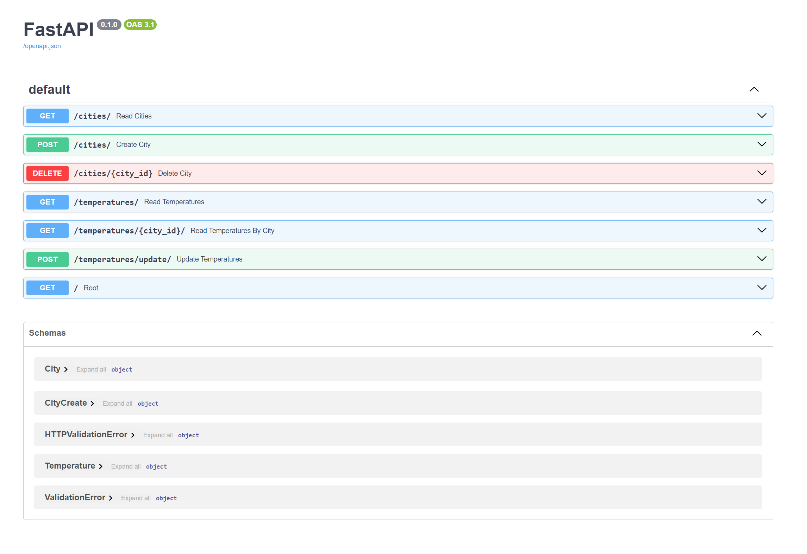

# City Temperature Management API

## Description
The City Temperature Management API provides functionality for managing city data and their temperatures. The application is implemented using FastAPI and SQLite with asynchronous request handling.

## Installation and Running
#### Install Dependencies:

```bash
python -m venv venv
source venv/bin/activate  # Linux/Mac
venv\Scripts\activate  # Windows

pip install -r requirements.txt
```

## Database Setup
#### Initialize Alembic for managing database migrations:

```bash
alembic init alembic
```

## Configure alembic.ini to specify your database URL. In our case, this is SQLite:

```ini
sqlalchemy.url = sqlite+aiosqlite:///./test.db
```

## Create and apply the migration:

```bash
alembic revision --autogenerate -m "initial"
alembic upgrade head
```
## Running the Application
#### Run the FastAPI server using Uvicorn:

```bash
uvicorn main:app --reload
```
The server will now be available at http://127.0.0.1:8000

## Available Endpoints
### City CRUD API
- POST /cities: Create a new city.
- GET /cities: Get a list of all cities.
- GET /cities/{city_id}: Get details of a specific city (optional).
- PUT /cities/{city_id}: Update details of a specific city (optional).
- DELETE /cities/{city_id}: Delete a specific city.
### Temperature API
- POST /temperatures/update: Update current temperature data for all cities in the database.
- GET /temperatures: Get a list of all temperature records.
- GET /temperatures/?city_id={city_id}: Get temperature records for a specific city.
- Design and Architecture
- FastAPI: Chosen for its high performance and support for asynchronous programming.
- SQLAlchemy: Used for interacting with the SQLite database, simplifying data management and migrations.
- Alembic: Manages database migrations, allowing easy changes to the database structure as the application evolves.


